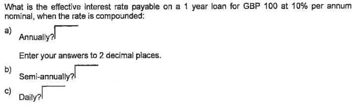
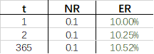
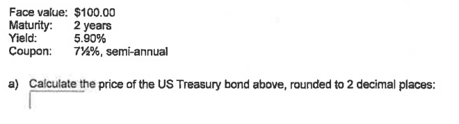

# 
Homework1-Time Value of Money

 
    Name: 陈锰  
    ID: 3170105197   
    Major: Software Engineering

## Requirement

> Question 2 , Question 5
>
> - Due 23:59, Sat, 21 Mar 2020
>
> - Email your assignments and project as attachments to zjubts@163.com with the following information in the email subject: 
>
>   > 学号-姓名-作业序号

## Question 2

> 

**Solution**:

==Formula==: $ER=(1+NR/t)^t-1$

==Excel==: 

a. $\text{ER}=(1+\frac{10\%}{1})^1-1=10.00\%$

b. $\text{ER}=(1+\frac{10\%}{2})^2-1= 10.25\%$

c. $\text{ER}=(1+\frac{10\%}{365})^{365}-1\approx 10.52\%$

## Question 5

> 

**Solution:**

==Formula==: $\text{Bond Price} = C/t\times \frac{D_1(1-D_{n\times t})}{1-D_1}+\text{Principal}\times D_{n\times t}$
$$
\begin{equation}\begin{split}
D_1 &=\frac{1}{1+\frac{5.90\%}{2}},\qquad D_4=(D_1)^4\\
PV &=\frac{100\times7.5\%}{2}\times \frac{D_1(1-D_4)}{1-D_1}+100\times D_4\approx $102.98
\end{split}\end{equation}
$$
