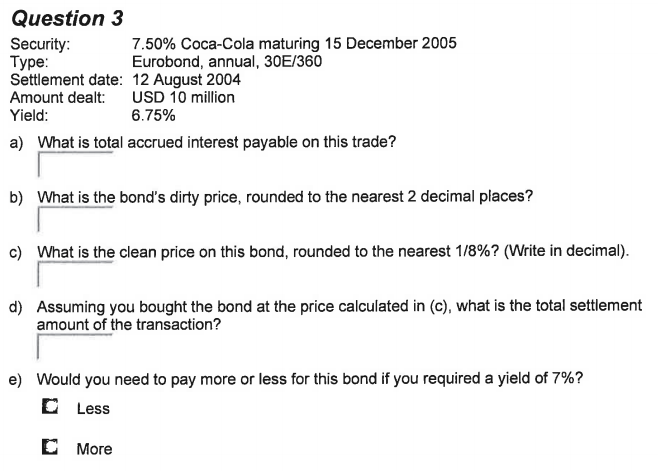
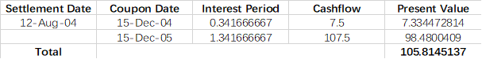
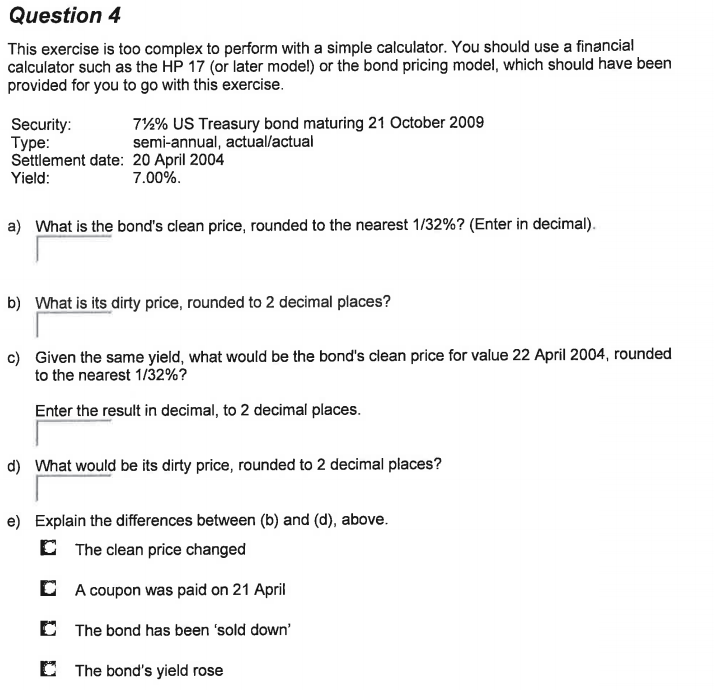
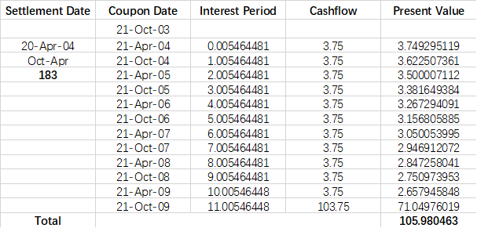
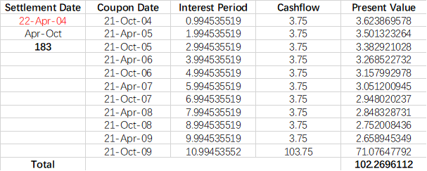

# 
Homework2

 
    Name: 陈锰  
    ID: 3170105197   
    Major: Software Engineering

## Requirement

> Bond Fundamentals – Page 13
>
> - Question 3 
> - Question 4
>
> - **Due 23:59, Sat, 4 Apr 2020 (one week after the whole course)**
>
> - Email your assignments and project as attachments to zjubts@163.com with the following information in the email subject: 
>
>   > 学号-姓名-作业序号

## Question 3

> 

**Solution:**

**a.**

Number of days in current period = 360

Number of days since last coupon = 15 Dec -> 12 Aug = 8*30-3=237

Factional coupon period = 237/360

Accrued interest = $C/t\times \text{Fractional coupon period}=7.5/1\times237/360=4.9375$

**b. **

Dirty price = PV = 105.81

**c.** Clean price = Dirty price - Accrued interest = 100.8770137 $\approx100.8775\%$

**d.** Settlement Amount = $10\text{million} \times \frac{105.8145137}{100}=10.58145137\text{million}$

**e.** Less, for the reason that the price of bond is inversely proportional to yield.

## Question 4

> 

**Solution**:

**a.**

Fractional coupon period = $\frac{\text{Numer of days since last coupon}}{\text{Number of days in current counpon period}}=\frac{182}{183}$

Accrued interest = $C/t\times \text{Fractional coupon period}=3.75\times\frac{182}{183}=3.729508197$

clean price = 105.980463 - 3.729508197 = 102.2509549 $\approx102.2509375\%$

**b.** dirty price = 105.980463 $\approx$105.98

**c.**

Fractional coupon period = $\frac{\text{Numer of days since last coupon}}{\text{Number of days in current counpon period}}=\frac{1}{183}$

Accrued interest = $C/t\times \text{Fractional coupon period}=3.75\times\frac{1}{183}=0.020491803$

clean price = 102.2696112-0.020491803 = 102.2491194 $\approx102.2490625\%$

**d.** dirty price = 102.2696112 $\approx102.27$

**e.**

- [x] The clean price changed
- [x] A coupon was paid on 21 April
- [ ] The bond was ‘sold down’
- [ ] The bond’s yield rose