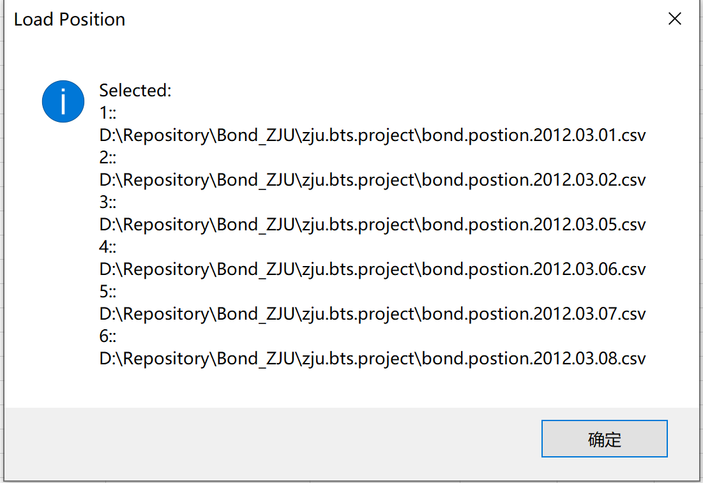

# <center>Bond Project</center>

<div align=center> 
    Name: 陈锰 <br/>
    ID: 3170105197 <br/> 
    Major: Software Engineering
</div>

#### User Manual

- Load Yield File

  - Open the sheet “Yield.Curve”

  - Click the button “Load_Yield” and select excel files(.csv, .xls, etc) from the file dialog

    - There will be a information-type message box prompting you the selected files

      

    - There will be a information-type message box prompting you that no file is selected

      

    - There will be a warning-type message box showing the redundant dates

      

  - Click the button “Plot_Yield” to learning more about yield curves    ==Optional==

- Load Position

  - Open the sheet “Bond.Position”
  - Click the button “Load_Position” and select excel files(.csv, .xls, etc) from the file dialog
    - There will be a information-type message box prompting you the selected files or no file is selected
    - There will be a warning-type message box showing the redundant dates

- Calculate and Plot Position-BPV

  - Click the button “Calculate_Plot” to obtain the Dirty Price, Accrued Interest, Clean Price, Modified Duration and Position-BPV, then you can find the Position-BPV line chart in the sheet “Position.BPV.Curve”

**Note that once you click the button to plot this curve, the former chart will be deleted, thus save the chart in advance if it’s important.**

#### Example Result


#### Appendix(Code)

###### Mudule 1

```vbscript
Option Explicit
'@Brief: determine whether an item is in the range or not
Function isIn(item As Variant, container As Range) As Boolean
    isIn = Not container.Find(item, LookIn:=xlValues) Is Nothing
End Function
'@Brief: load one csv file from the filefolder and write data to out sheet
'@Return: the redundant date
Function loadFile(path As String, outSheet As Worksheet) As String
    Dim inWb As Workbook
    Set inWb = GetObject(path)
    Dim items As Variant, row As Integer, col As Integer, start As Integer
    start = outSheet.UsedRange.Rows.Count
    For row = 1 To inWb.Sheets(1).UsedRange.Rows.Count
        items = Split(inWb.Sheets(1).Cells(row, 1).Value, "|")
        If isIn(items(0), outSheet.Range("a1:a" & start)) Then
            loadFile = items(0)
            Exit Function
        Else
            For col = 0 To UBound(items)
                'Add Str(20) to the year values of date items
                If InStr(items(col), "-") > 0 Then
                    items(col) = Mid(items(col), 1, InStrRev(items(col), "-")) & "20" & Mid(items(col), InStrRev(items(col), "-") + 1)
                End If
                outSheet.Cells(row + start, col + 1).Value = items(col)
            Next
        End If
    Next
    loadFile = ""
End Function
'@Brief: load and deal with files from selected items in the folefolder
Sub loadFiles(sheet As Worksheet, name As String)
    Dim index As Integer, files As String, existed As String
    With Application.FileDialog(msoFileDialogFilePicker)
        .AllowMultiSelect = True
        .Filters.Clear
        .Filters.Add "Excel Files", "*.xls;*.xlw;*.csv"
        .Show
        
        For index = 1 To .SelectedItems.Count
            files = files & Chr(10) & index & ":: " & .SelectedItems(index)
            existed = existed & Chr(10) & loadFile(.SelectedItems(index), sheet)
        Next
        'Some prompts
        If .SelectedItems.Count > 0 Then
            MsgBox "Selected: " & files, vbOKOnly + vbInformation, name
        Else
            MsgBox "No file is selected.", vbOKOnly + vbInformation, name
        End If
        If Len(Replace(existed, Chr(10), "")) > 0 Then
            MsgBox "Existed date: " & existed, vbOKOnly + vbExclamation, name
        End If
    End With
End Sub
'@Brief: linear interpolation function for fetching yield
Function linearInterpolate(value1 As Double, value2 As Double, rate As Double) As Double
    linearInterpolate = value1 * (1 - rate) + value2 * rate
End Function
'@Brief: fetch yild form sheet "Yield.Curve"
'@Return: interpolated yield value
Function fetchYield(settlementDate As Date, couponDate As Date) As Double
    Dim row As Range
    'Find the corresponded row with the same date
    Set row = Worksheets("Yield.Curve").Range("a:a").Find(settlementDate, LookIn:=xlFormulas, lookat:=xlWhole)
    If row Is Nothing Then
        MsgBox "[Error]No such a date in the Sheet Yield.Curve " _
        & Chr(10) & "Date: " & settlementDate _
        , vbOKOnly + vbCritical, "Fetch Yield"
        Exit Function
    End If
    Dim duration
    Dim diff As Double
    Dim index As Integer
    'Maturity duration by month
    duration = Array(1, 3, 6, 12, 24, 36, 60, 84, 120, 240, 360)
    'Calculate the total maturity duration by day
    diff = DateDiff("m", settlementDate, couponDate)
    'Find the right position of maturity duration
    For index = LBound(duration) To UBound(duration)
        If duration(index) >= diff Then
            Exit For
        End If
    Next
    Dim startDate As Date, endDate As Date
    'Find the last date and the next date between which the maturity locates
    startDate = DateAdd("m", duration(index - 1), settlementDate)
    endDate = DateAdd("m", duration(index), settlementDate)
    'Calculate the duration portion
    diff = DateDiff("d", startDate, couponDate) / DateDiff("d", startDate, endDate)
    'Calculate yield through linear interpolation
    fetchYield = linearInterpolate(row.Offset(0, index), row.Offset(0, index + 1), diff) / 100
    'MsgBox "From " & settlementDate & " To " & couponDate & " Yield: " & fetchYield _
    '& Chr(10) & "C1: " & row.Offset(0, index) & " C2: " & row.Offset(0, index + 1)
End Function
'@Brief: calculate duration portion for later use
Function calPeriodRatio(settlementDate As Date, couponDate As Date, frequency As Integer, mode As Boolean) As Double
    Dim lastCouponDate As Date, nextCouponDate As Date
    lastCouponDate = CDate(Year(settlementDate) & "-" & Month(couponDate) & "-" & Day(couponDate))
    While (DateDiff("d", settlementDate, lastCouponDate) > 0)
        lastCouponDate = DateAdd("m", -12 / frequency, lastCouponDate)
    Wend
    nextCouponDate = DateAdd("m", 12 / frequency, lastCouponDate)
    If mode Then
        calPeriodRatio = DateDiff("d", settlementDate, nextCouponDate) / DateDiff("d", lastCouponDate, nextCouponDate)
    Else
        calPeriodRatio = DateDiff("d", lastCouponDate, settlementDate) / DateDiff("d", lastCouponDate, nextCouponDate)
    End If
End Function
'@Brief: calculate accrued interest
Function calAccruedInterest(coupon As Double, frequency As Integer, settlementDate As Date, couponDate As Date) As Double
    calAccruedInterest = coupon / frequency * calPeriodRatio(settlementDate, couponDate, frequency, False)
End Function
'@Brief: calculate a
Function calA(frequency As Integer, settlementDate As Date, couponDate As Date) As Double
    calA = calPeriodRatio(settlementDate, couponDate, frequency, True)
End Function
'@Brief: calculate dirty price and modified duration
'@Return: array of PV and MD
Function calDirtyPriceAndModifiedDuration(coupon As Double, frequency As Integer, settlementDate As Date, couponDate As Date) As Variant
    Dim yield As Double, cashflow As Double, a  As Double, PV As Double, MD As Double
    Dim i As Integer, m As Integer, D1 As Double, item As Double
    'Calculate a
    a = calA(frequency, settlementDate, couponDate)
    'Fetch yield
    yield = fetchYield(settlementDate, couponDate)
    'Calculate number of complete coupon period
    m = Int(DateDiff("m", settlementDate, couponDate) / 12 * frequency)
    'Cashflow in the beginning
    cashflow = coupon / frequency
    'Factor for later use
    D1 = 1 / (1 + yield / frequency)
    PV = 0
    MD = 0
    For i = 0 To m
        item = D1 ^ (a + i)
        PV = PV + item
        MD = MD + (a + i) * item
    Next
    PV = coupon / frequency * PV + 100 * item
    MD = (coupon / frequency * MD + 100 * (a + m) * item) / PV / frequency * D1
    calDirtyPriceAndModifiedDuration = Array(PV, MD)
End Function
```

###### Sheet “Yield.Curve”

```vbscript
Option Explicit

Private Sub Load_Yield_Click()
'Pls ensure the following functions
'1. pop up a window for user to select the file to load
'2. if the data of a particular date exists, a warning msg will be shown
'3. col A to col L will be populated with the data from yc.2012.MM.DD.csv
    loadFiles Worksheets("Yield.Curve"), "Load Yield"
End Sub
'@Brief: plot Yield.Curve
Private Sub Plot_Yield_Click()
    Dim chart As ChartObject, sheet As Worksheet
    Dim row As Integer, endRow As Integer
    Set sheet = Worksheets("Yield.Curve")
    endRow = sheet.UsedRange.Rows.Count
    Application.ScreenUpdating = False
    'Clear the old charts
    If sheet.ChartObjects.Count > 0 Then
        sheet.ChartObjects.Delete
    End If
    'Add a chart at [m5]
    Set chart = sheet.ChartObjects.Add(sheet.[m5].Left, sheet.[m5].Top, 300, 300)
    With chart.chart
        .HasTitle = True
        .ChartTitle.Text = "Yield Curve"
        .ChartTitle.Font.Size = 18
        .HasLegend = True
        .Legend.Font.Size = 8
        .Legend.Font.ColorIndex = 5
        .Legend.position = xlLegendPositionRight
        'Config the Y label
        With .Axes(xlValue, xlPrimary)
            .CrossesAt = .MinimumScale
            .TickLabels.Font.Size = 8
            .HasTitle = True
            .AxisTitle.Text = "Yield(%)"
            .AxisTitle.Characters.Font.Size = 12
            .AxisTitle.Orientation = xlUpward
        End With
        'Config the X label
        With .Axes(xlCategory)
            .TickLabels.Font.Size = 8
            .TickLabels.Orientation = 50
            .HasTitle = True
            .AxisTitle.Text = "Maturity"
            .AxisTitle.Characters.Font.Size = 12
        End With
        For row = 2 To endRow
            With .SeriesCollection.NewSeries
                .Values = sheet.Range("b" & row & ":l" & row)
                .XValues = sheet.Range("b1:l1")
                .ChartType = xlLineMarkers
                .name = sheet.Range("A" & row).Value
                .MarkerSize = 3
                .Format.Line.Weight = 0.8
                .MarkerStyle = xlMarkerStyleTriangle
                .MarkerForegroundColor = RGB(171, 130, 255)
                .MarkerBackgroundColor = RGB(171, 130, 255)
                .HasDataLabels = False
            End With
        Next
    End With
End Sub
```

###### Sheet “Bond.Position”

```vbscript
Option Explicit

Private Sub Load_Position_Click()
'Pls ensure the following functions
'1. pop up a window for user to select the file to load
'2. if the data of a particular date exists, a warning msg will be shown
'3. col A to col E will be populated with the data from bond.postion..2012.MM.DD.csv
    loadFiles Worksheets("Bond.Position"), "Load Position"
End Sub

Private Sub Calculate_Plot_Click()
'Pls ensure the following functions
'1. pop up a window for user to select the file to load
'2. if the data of a particular date exists, a warning msg will be shown
'3. col F to col J will be populated
'4. Plot the whole book's Position BPV curve. The book includes 4 bond (A, B, C and D)
    Dim sheet As Worksheet
    Dim coupon As Double, position As Double
    Dim settlementDate As Date, couponDate As Date
    Dim row As Integer, col As Integer, PV_MD As Variant
    Set sheet = Worksheets("Bond.Position")
    For row = 2 To sheet.UsedRange.Rows.Count
        'Fetch information
        settlementDate = sheet.Range("a" & row).Value
        coupon = sheet.Range("c" & row).Value
        couponDate = sheet.Range("d" & row).Value
        position = sheet.Range("e" & row).Value
        'Calculate dirty price and modified duration
        PV_MD = calDirtyPriceAndModifiedDuration(coupon, 2, settlementDate, couponDate)
        sheet.Range("h" & row).Value = PV_MD(0)
        sheet.Range("i" & row).Value = PV_MD(1)
        'Calculate accrued interest
        sheet.Range("g" & row).Value = calAccruedInterest(coupon, 2, settlementDate, couponDate)
        'Clean price = dirty price - accrued interest
        sheet.Range("f" & row).Value = sheet.Range("h" & row).Value - sheet.Range("g" & row).Value
        'Calculate position basis point value
        sheet.Range("j" & row).Value = sheet.Range("e" & row).Value * PV_MD(0) / 100 * PV_MD(1) / 100
    Next
    
    'Plot Position.BPV.Curve
    plotPositionBPV sheet, Worksheets("Position.BPV.Curve")
End Sub
'@Brief: search the range for xValues and yValues for line chart
Private Sub searchXYRange(sheet As Worksheet, ByRef xDictionary As Variant, ByRef yDictionary As Variant)
    Dim i As Integer, n As Integer, name As String, item
    n = sheet.UsedRange.Rows.Count
    For i = 2 To n
        'B: name A:XValue J:yValue
        name = sheet.Range("b" & i).Value
        xDictionary(name) = xDictionary(name) & "a" & i & ","
        yDictionary(name) = yDictionary(name) & "j" & i & ","
        'MsgBox "Name: " & name & Chr(10) & "X: " & xDictionary(name) & Chr(10) & "Y: " & yDictionary(name)
    Next
    For Each item In xDictionary.keys
        xDictionary(item) = Left(xDictionary(item), Len(xDictionary(item)) - 1)
        yDictionary(item) = Left(yDictionary(item), Len(yDictionary(item)) - 1)
    Next
End Sub
'@Brief: plot Position.BPV.Curve
Private Sub plotPositionBPV(sheet As Worksheet, outSheet As Worksheet)
    Dim chart As ChartObject
    Application.ScreenUpdating = False
    'Clear the old charts
    If outSheet.ChartObjects.Count > 0 Then
        outSheet.ChartObjects.Delete
    End If
    'Add a chart at [a1]
    Set chart = outSheet.ChartObjects.Add(sheet.[a1].Left, sheet.[a1].Top, 400, 300)
    With chart.chart
        'Config the chart
        .HasTitle = True
        .ChartTitle.Text = "Position.BPV.Curve"
        .ChartTitle.Font.Size = 18
        .HasLegend = True
        .Legend.Font.Size = 8
        .Legend.Font.ColorIndex = 5
        .Legend.position = xlLegendPositionRight
        'Config the Y label
        With .Axes(xlValue, xlPrimary)
            .CrossesAt = .MinimumScale
            .TickLabels.Font.Size = 8
            .HasTitle = True
            .AxisTitle.Text = "Position.BPV"
            .AxisTitle.Characters.Font.Size = 12
            .AxisTitle.Orientation = xlUpward
        End With
        'Config the X label
        With .Axes(xlCategory)
            .TickLabels.Font.Size = 8
            .TickLabels.Orientation = 50
            .HasTitle = True
            .AxisTitle.Text = "Settlement Date"
            .AxisTitle.Characters.Font.Size = 12
        End With
        Dim xDictionary, yDictionary, item
        Set xDictionary = CreateObject("Scripting.Dictionary")
        Set yDictionary = CreateObject("Scripting.Dictionary")
        searchXYRange sheet, xDictionary, yDictionary
        For Each item In xDictionary.keys
            'MsgBox "Name: " & item & " xValue: " & xDictionary(item) & " yValue: " & yDictionary(item)
            With .SeriesCollection.NewSeries
                .Values = sheet.Range(yDictionary(item))
                .XValues = sheet.Range(xDictionary(item))
                .ChartType = xlLineMarkers
                .name = item
                .MarkerSize = 5
                .Format.Line.Weight = 1
                .MarkerStyle = xlMarkerStyleTriangle
                .MarkerForegroundColor = RGB(171, 130, 255)
                .MarkerBackgroundColor = RGB(171, 130, 255)
                .HasDataLabels = False
            End With
        Next
    End With
End ub
```

